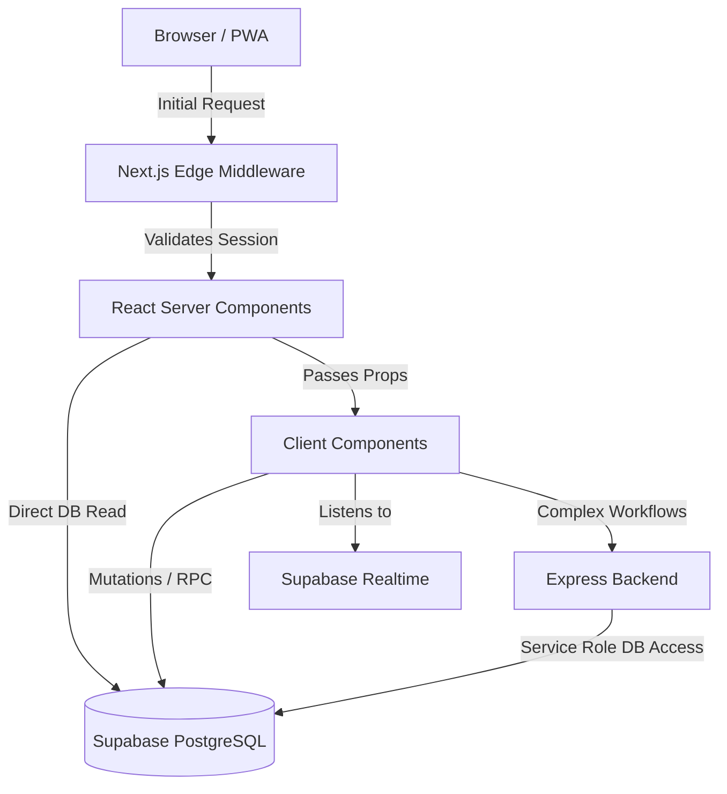

# System Architecture

✅ **Status**: Implemented

## Frontend Architecture
The frontend is built on **Next.js 15** utilizing the **App Router**. 
- **React Server Components (RSC):** Used heavily for layouts, top-level page components, and metadata.
- **Client Components (`'use client'`):** Restricted to leaf nodes requiring interactivity (maps, proximity HUD, forms, state-bound UI).
- **Rendering Strategy:** Hybrid SSR/CSR. Pages are server-rendered for speed, while heavily dynamic sections (Mapbox) are dynamically imported with `ssr: false` to prevent server mismatch.

## Backend Architecture
The backend is bifurcated into two primary engines:
1. **Supabase (BaaS):** Acts as the primary backend. PostgreSQL handles data persistence. PostgREST serves the API. GoTrue handles auth.
2. **Express.js API (`/backend`):** A custom Node.js server. Exists strictly to handle operations that are unsafe or inappropriate for Edge/Client directly (e.g., GePG payment callbacks, deep data aggregation cron jobs).

## Data & API Flow

## Authentication Flow
1. User submits credentials via Client Component.
2. Request hits Supabase Auth.
3. Supabase issues JWT.
4. `@supabase/ssr` writes the JWT to an `HttpOnly` cookie.
5. `middleware.ts` intercepts all requests to `/(citizen)`, `/(admin)`, `/(driver)` and verifies the cookie. If invalid, redirects to `/login`.

## Storage & Realtime
- **Storage:** Handled by Supabase Storage. Clients request signed URLs for private files or use public URLs for assets (avatars).
- **Realtime:** The system relies on Supabase Realtime (Postgres Changes) to push `vehicle_current_location` updates instantly to connected clients viewing the Mapbox map.

## Deployment Architecture
- **Frontend:** Target: Vercel (Optimized for Next.js App Router and Edge Middleware).
- **Backend (Express):** Target: Railway or Render.
- **Database:** Supabase Cloud (Managed).
